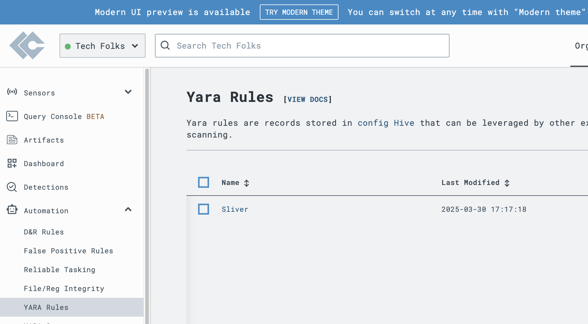
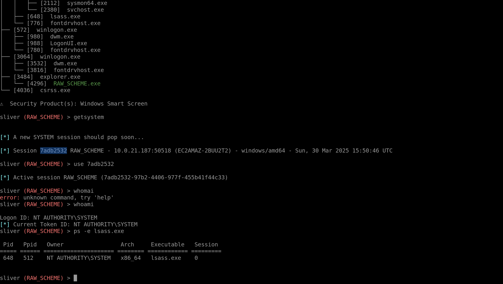
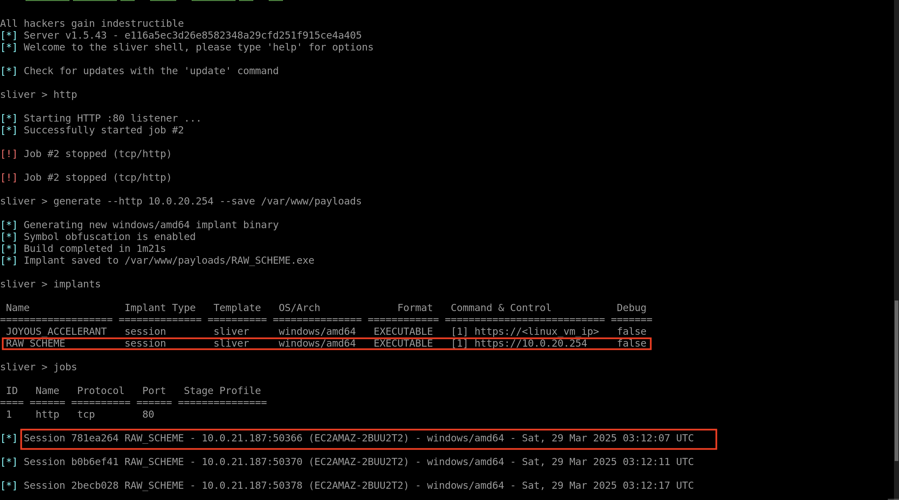
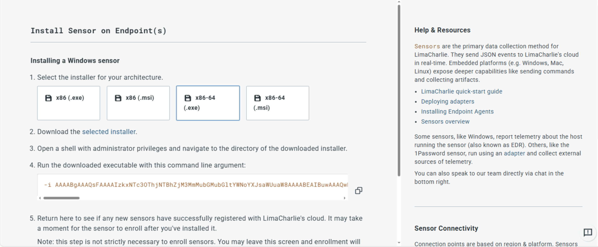
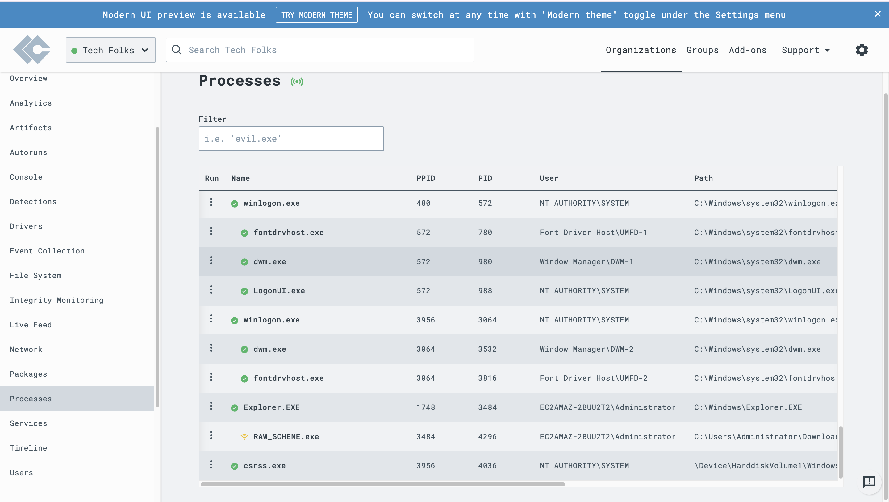

# SOC-Analayst-Hands on-Lab

# Advanced SOC Analyst Lab with LimaCharlie

## Introduction
Welcome to my Advanced SOC Analyst Lab, a hands-on cybersecurity project designed to simulate a Security Operations Center (SOC) environment using [LimaCharlie](https://limacharlie.io/), a free-tier Endpoint Detection and Response (EDR) and Security Information and Event Management (SIEM) platform. Inspired by the practical, execution-focused approach of the "So You Want to Be a SOC Analyst?" course ([link](https://ddi.sh/sywtbsa)), this project goes beyond theory to deliver a fully functional lab where I:
- Set up and running live attack simulations
- Use EDR solutions to detect adversary actions
- Building and testing custom detection & blocking rules
- Analyzing telemetry from real malware and C2 frameworks
 This repository serves as a portfolio piece to demonstrate my readiness for a SOC analyst role, highlighting skills in threat simulation, EDR configuration, rule engineering, and data analysis—all critical competencies sought by cybersecurity employers.

---

## Project Goals
- **Threat Simulation**: Replicate adversarial tactics (e.g., ransomware encryption, C2 beaconing) to understand attacker behavior.
- **Detection and Response**: Build and test precise detection rules and automated blocking actions in a live environment.
- **Telemetry Analysis**: Parse and visualize attack data to uncover patterns and validate response efficacy.
- **Professional Documentation**: Present the project in a clear, structured way suitable for technical review or interview discussions.

---

## Skills Showcased
- **Threat Simulation**: Crafted Python scripts to mimic ransomware and APT-style C2 persistence.
- **EDR Proficiency**: Configured LimaCharlie for real-time monitoring, detection, and response.
- **Rule Engineering**: Developed multi-condition YAML rules to catch subtle attack indicators while minimizing false positives.
- **Data Analysis**: Used Python to process JSON telemetry logs and generate an attack timeline graph.
- **Cloud Infrastructure**: Deployed and secured Ubuntu VMs on AWS Free Tier for attack-and-defend scenarios.
- **Technical Communication**: Documented setup, execution, and findings in a concise, employer-friendly format.

---

| Skill | Tool/Method |
|-------|-------------|
| Threat Simulation | Python, Cryptography |
| EDR Configuration | LimaCharlie |
| Rule Creation | YAML, Logical Operators |
| Telemetry Analysis | Matplotlib, JSON Parsing |
| Cloud Setup | AWS EC2, SSH |

---

#  Part 1: Setting Up the Environment

####  Virtualization Setup
To simulate a realistic network environment, I set up two virtual machines (VMs):
- **Windows VM**: For testing and simulating attacks.
- **Linux (Ubuntu) VM**: For running various security tools.

####  Setup a free LimaCharlie account
LimaCharlie is a powerful “SecOps Cloud Platform”. It not only comes with a cross-platform EDR agent, but also handles all of the log shipping/ingestion and has a threat detection engine.
[Click here to create a free LimaCharlie account](https://limacharlie.io/)  
- Once the org is created, click “Add Sensor”
- Select the Endpoint tab

- Select Windows

- Provide a description such as: Windows VM - Lab

- Click Create

- Select the Installation Key we just created
- Add Sensor
   
   Add Sensor
  
 ## Configure LimaCharlie to ingest Sysmon logs from our VM
- I configure LimaCharlie to also ship the Sysmon event logs alongside its own EDR telemetry
- LimaCharlie will now start shipping Sysmon logs which provide a wealth of EDR-like telemetry, some of which is redundant to LC’s own telemetry, but Sysmon is still a very power visibility tool that runs well alongside any EDR agent.
- Another reason i am ingesting Sysmon logs is that the built-in Sigma rules we are about to enable largely depend on Sysmon logs as that is what most of them were written for.

  
    Sysmon Config

  
##  Enable Sigma EDR Ruleset
- Finally, let’s turn on the open source Sigma ruleset to assist our detection efforts.

  Sigma Ruleset

# Part 2: Adversary Simulation

In the second part of the series, I focused on simulating adversarial activities to understand how attackers operate and how to detect their actions effectively.

####  Command and Control (C2) Setup
To simulate real-world attacks, I set up a Command and Control (C2) server using Sliver, an open-source C2 framework. This involved generating a payload and deploying it on the Windows VM to establish a communication channel between the attacker (C2 server) and the victim (Windows VM).

####  Executing the Payload
I executed the generated payload on the Windows VM, which initiated a connection back to the C2 server. This setup allowed me to interact with the compromised system through the C2 framework, mimicking the actions of a real attacker.

- One of the easiest ways to spot unusual processes is to simply look for ones that are NOT signed

- My C2 implant shows as not signed, and is also active on the network.

     
    Start Sliver
    
   
     Generate C2

   
    Download Implant on WIndows VM

   
    Sessions

      
    Info

   
    Process Tree

   
    Process Tree 2

### Exploring EDR Telemetry
- Using the telemetry data from LimaCharlie’s EDR platform, I monitored the activities performed through the C2 connection. This included observing process trees, network connections, and other system behaviors that indicated a compromise.

  
   Processes

  
   Network

  
   File System

 
   Hash

  
   Virus Total

  

- Simulating adversarial actions provided me with vital insights into attacker tactics, methods, and procedures (TTPs), allowing me to better recognize and respond to real-world threats.

# Part 3: Crafting and Detecting Attacks

In the third part of the series, I concentrated on simulating and identifying various attack strategies in order to better understand threat detection.

####  Credential Dumping
To simulate credential theft, I used a tool called `procdump` to dump the `lsass.exe` process memory. This technique is commonly used by attackers to extract credentials from memory.

####  Detecting Malicious Activities
Using LimaCharlie’s EDR, I analyzed the telemetry data generated from the credential dumping activity. This involved identifying key indicators of compromise (IoCs) and creating detection rules to alert on such activities.

Sensitive Process

 
  
  
  
  
  
  
  
  
  
 
  
  
 
  
  

  
  
  
  
  
  
  

  
  
  
  
   
  
  
