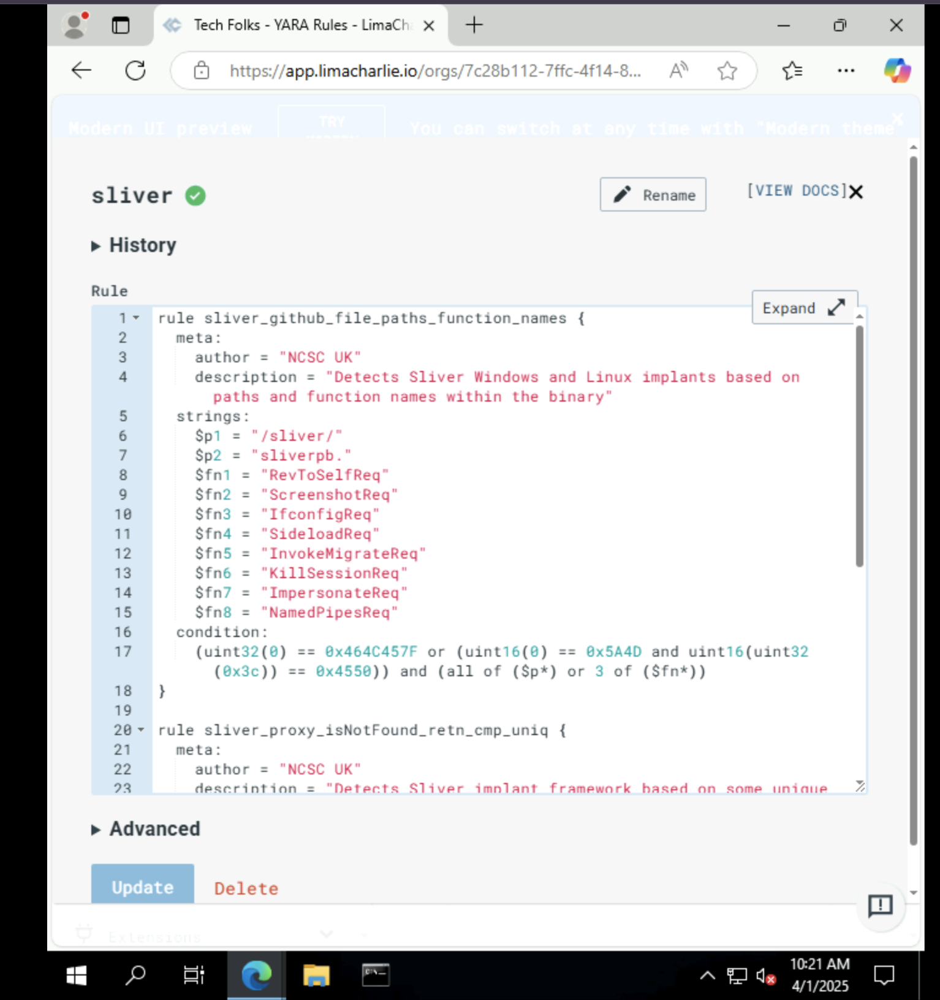

# SOC-Analayst-Hands on-Lab

# Advanced SOC Analyst Lab with LimaCharlie

## Introduction
Welcome to my Advanced SOC Analyst Lab, a hands-on cybersecurity project designed to simulate a Security Operations Center (SOC) environment using [LimaCharlie](https://limacharlie.io/), a free-tier Endpoint Detection and Response (EDR) and Security Information and Event Management (SIEM) platform. Inspired by the practical, execution-focused approach of the "So You Want to Be a SOC Analyst?" course ([link](https://ddi.sh/sywtbsa)), this project goes beyond theory to deliver a fully functional lab where I:
- Set up and running live attack simulations
- Use EDR solutions to detect adversary actions
- Building and testing custom detection & blocking rules
- Analyzing telemetry from real malware and C2 frameworks
 This repository serves as a portfolio piece to demonstrate my readiness for a SOC analyst role, highlighting skills in threat simulation, EDR configuration, rule engineering, and data analysis—all critical competencies sought by cybersecurity employers.

---

## Project Goals
- **Threat Simulation**: Replicate adversarial tactics (e.g., ransomware encryption, C2 beaconing) to understand attacker behavior.
- **Detection and Response**: Build and test precise detection rules and automated blocking actions in a live environment.
- **Telemetry Analysis**: Parse and visualize attack data to uncover patterns and validate response efficacy.
- **Professional Documentation**: Present the project in a clear, structured way suitable for technical review or interview discussions.

---

## Skills Showcased
- **Threat Simulation**: Crafted Python scripts to mimic ransomware and APT-style C2 persistence.
- **EDR Proficiency**: Configured LimaCharlie for real-time monitoring, detection, and response.
- **Rule Engineering**: Developed multi-condition YAML rules to catch subtle attack indicators while minimizing false positives.
- **Data Analysis**: Used Python to process JSON telemetry logs and generate an attack timeline graph.
- **Cloud Infrastructure**: Deployed and secured Ubuntu VMs on AWS Free Tier for attack-and-defend scenarios.
- **Technical Communication**: Documented setup, execution, and findings in a concise, employer-friendly format.

---

| Skill | Tool/Method |
|-------|-------------|
| Threat Simulation | Python, Cryptography |
| EDR Configuration | LimaCharlie |
| Rule Creation | YAML, Logical Operators |
| Telemetry Analysis | Matplotlib, JSON Parsing |
| Cloud Setup | AWS EC2, SSH |

---

#  Part 1: Setting Up the Environment

####  Virtualization Setup
To simulate a realistic network environment, I set up two virtual machines (VMs):
- **Windows VM**: For testing and simulating attacks.
- **Linux (Ubuntu) VM**: For running various security tools.

####  Setup a free LimaCharlie account
LimaCharlie is a powerful “SecOps Cloud Platform”. It not only comes with a cross-platform EDR agent, but also handles all of the log shipping/ingestion and has a threat detection engine.
[Click here to create a free LimaCharlie account](https://limacharlie.io/)  
- Once the org is created, click “Add Sensor”
- Select the Endpoint tab

- Select Windows

- Provide a description such as: Windows VM - Lab

- Click Create

- Select the Installation Key we just created
- Add Sensor
   
   Add Sensor
  
 ## Configure LimaCharlie to ingest Sysmon logs from our VM
- I configure LimaCharlie to also ship the Sysmon event logs alongside its own EDR telemetry
- LimaCharlie will now start shipping Sysmon logs which provide a wealth of EDR-like telemetry, some of which is redundant to LC’s own telemetry, but Sysmon is still a very power visibility tool that runs well alongside any EDR agent.
- Another reason i am ingesting Sysmon logs is that the built-in Sigma rules we are about to enable largely depend on Sysmon logs as that is what most of them were written for.

  
    Sysmon Config

  
##  Enable Sigma EDR Ruleset
- Finally, let’s turn on the open source Sigma ruleset to assist our detection efforts.

  
  Sigma Ruleset

# Part 2: Adversary Simulation

In the second part of the series, I focused on simulating adversarial activities to understand how attackers operate and how to detect their actions effectively.

####  Command and Control (C2) Setup
To simulate real-world attacks, I set up a Command and Control (C2) server using Sliver, an open-source C2 framework. This involved generating a payload and deploying it on the Windows VM to establish a communication channel between the attacker (C2 server) and the victim (Windows VM).

####  Executing the Payload
I executed the generated payload on the Windows VM, which initiated a connection back to the C2 server. This setup allowed me to interact with the compromised system through the C2 framework, mimicking the actions of a real attacker.

- One of the easiest ways to spot unusual processes is to simply look for ones that are NOT signed

- My C2 implant shows as not signed, and is also active on the network.

     
    Start Sliver
    
   
     Generate C2

   
    Download Implant on WIndows VM

   
    Sessions

      
    Info

   
    Process Tree

   
    Process Tree 2

### Exploring EDR Telemetry
- Using the telemetry data from LimaCharlie’s EDR platform, I monitored the activities performed through the C2 connection. This included observing process trees, network connections, and other system behaviors that indicated a compromise.

  
   Processes

  
   Network

  
   File System

  
   Hash

  
   Virus Total
   
- If the file is a common/well-known malware sample, you will know it right away when VirusTotal reports it as such. However, “Item not found” on VT does not mean that this file is innocent, just that it’s never been seen before by VirusTotal. This is because we just generated this payload ourselves, so of course it’s not likely to be seen by VirusTotal before.
  
- This actually makes a file even more suspicious because nearly everything has been seen by VirusTotal, so your sample may have been custom-crafted/targeted which ups the ante a bit
#### Simulating adversarial actions provided me with vital insights into attacker tactics, methods, and procedures (TTPs), allowing me to better recognize and respond to real-world threats.

# Part 3: Crafting and Detecting Attacks

In the third part of the series, I concentrated on simulating and identifying various attack strategies in order to better understand threat detection.

####  Credential Dumping
To simulate credential theft, I used a tool called `procdump` to dump the `lsass.exe` process memory. This technique is commonly used by attackers to extract credentials from memory.

####  Detecting Malicious Activities
Using LimaCharlie’s EDR, I analyzed the telemetry data generated from the credential dumping activity. This involved identifying key indicators of compromise (IoCs) and creating detection rules to alert on such activities.

 
 Sensitive Process

 
  Search Malware

  
 
  LSASS Detection rule

 
  Lsass Detection

####  By simulating and detecting these attacks, I gained a better understanding of the techniques used by attackers and the methods to effectively detect and respond to such threats. 

#  Part 4: Blocking Attacks

In the fourth part of the series, I focused on creating rules to block specific malicious activities and enhance the security posture of the system.

####  Creating Blocking Rules
I developed a rule to detect and block the deletion of Volume Shadow Copies, a common technique used by ransomware to prevent recovery. This involved setting up a detection rule in LimaCharlie to monitor for the `vssadmin delete shadows /all` command and automatically terminate the parent process executing this command.

####  Testing the Blocking Rules
To ensure the rule's effectiveness, I executed the `vssadmin delete shadows /all` command from the Sliver C2 session and observed the detection and response action in LimaCharlie. The rule successfully identified and blocked the activity, demonstrating its effectiveness in mitigating ransomware attacks.

  

 
 Detection and Reponse(D&R) rule

 
 Detecting Vss

 

 

#### By implementing these blocking rules, I significantly improved the system's defenses against ransomware and other destructive attacks.

#  Part 5: Advanced Detection with YARA

In the final part of the series, I delved into advanced detection techniques using YARA rules to identify specific malware signatures.

####  Writing and Testing YARA Rules
I wrote custom YARA rules to detect malicious payloads and tested these rules using LimaCharlie. This involved:
- Creating YARA rules tailored to detect specific characteristics of malware.
- Executing manual YARA scans on the Windows VM to validate the effectiveness of these rules.

  
   Writing YARA rules
  
    
   YARA Rules

##  Automating YARA Scans
To ensure continuous monitoring, I automated the YARA scanning process for new executable files in the Downloads directory. This setup allowed for real-time detection of potential threats as soon as new files were added.

  
  YARA Detection
  
   
  YARA Detection in memory

   
  Console

 ##  Scanning Processes Launched from Downloads
As part of the automation, I also set up rules to scan any process launched from the Downloads directory. This additional layer of security helps 
catch any malicious activity that might occur when new executables are run.  

  
    
 
 
 
